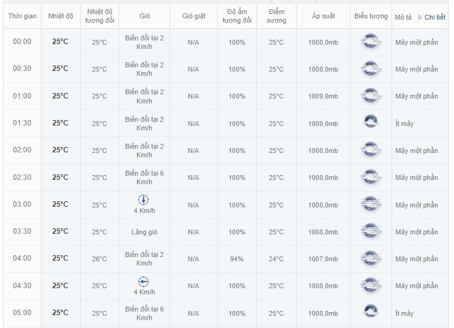
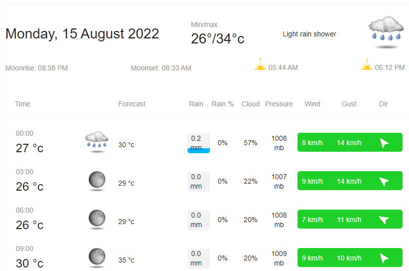

## Crawl Vietnamese Weather Data
We crawl data from 2 website: 

* [freemeteo](https://freemeteo.vn/)
* [world weather](https://www.worldweatheronline.com/vietnam-weather.aspx)

With the first website, we used pandas to parse html table to DataFrame and save to csv file. Specific the value of year to crawl data corresponding. Example data from the first website:

With the sencond website, we used selenium to click button and bs4 to parse html table. Data will be saved to csv file. Example data from second website:

